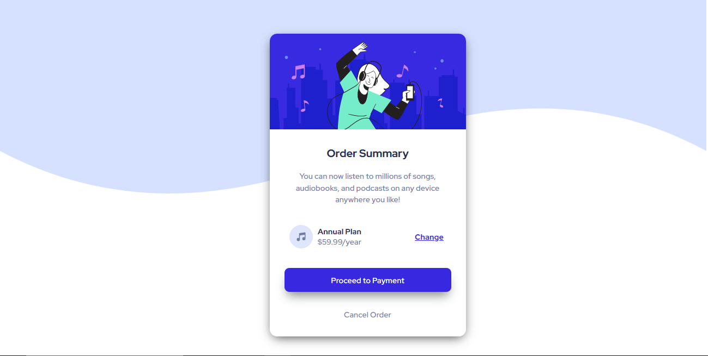

# Frontend Mentor - Order summary card solution

This is a solution to the [Order summary card challenge on Frontend Mentor](https://www.frontendmentor.io/challenges/order-summary-component-QlPmajDUj). Frontend Mentor challenges help you improve your coding skills by building realistic projects. 

## Table of contents

- [Overview](#overview)
  - [The challenge](#the-challenge)
  - [Screenshot](#screenshot)
  - [Links](#links)
- [My process](#my-process)
  - [Built with](#built-with)
  - [What I learned](#what-i-learned)
  - [Continued development](#continued-development)
  - [Useful resources](#useful-resources)
- [Author](#author)


**Note: Delete this note and update the table of contents based on what sections you keep.**

## Overview

### The challenge

Users should be able to:

- See hover states for interactive elements

### Screenshot



### Links

- Live Site URL: [Add live site URL here](https://stirring-kataifi-94efdf.netlify.app/)

## My process

### Built with

- Semantic HTML5 markup
- CSS custom properties
- flexbox

### What I learned

in the construction of the button I already have it more informed.

```css
.btn button {
    display: block;
    margin: 0 auto;
    padding: 14px 15px;
    border-radius: 10px;
    border: none;
    background-color: hsl(245, 75%, 52%);
    color: white;
    width: 100%;
    -webkit-box-shadow: 0px 14px 20px -6px rgba(136,142,143,1);
    -moz-box-shadow: 0px 14px 20px -6px rgba(136,142,143,1);
    box-shadow: 0px 14px 20px -6px rgba(136,142,143,1);
    cursor: pointer;
    transition: background-color 0.4s ease;
}
.btn button:hover {
    background-color: hsla(245, 75%, 52%, 0.7);
}
```

If you want more help with writing markdown, we'd recommend checking out [The Markdown Guide](https://www.markdownguide.org/) to learn more.

**Note: Delete this note and the content within this section and replace with your own learnings.**

### Continued development

I find it easier to do this type of thing a component with content inside.
I'm still learning.


## Author

- Frontend Mentor - [@isghost19](https://www.frontendmentor.io/profile/isghost19)

